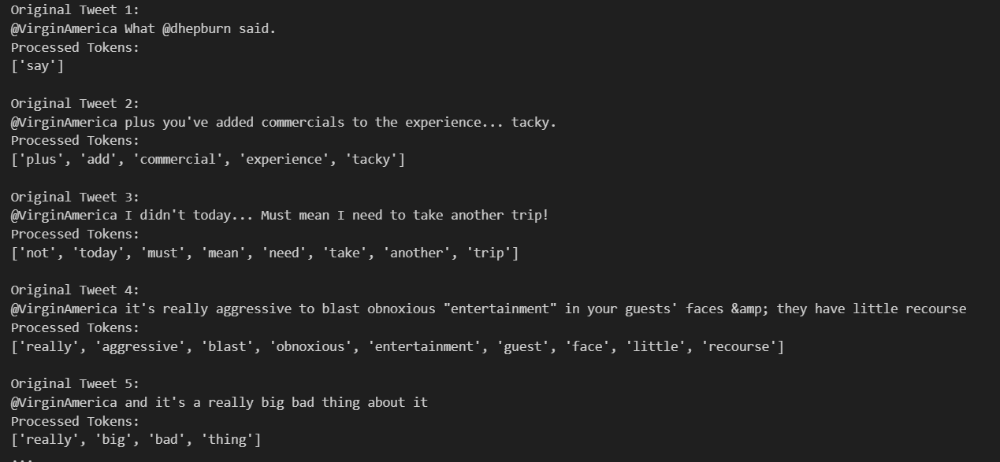
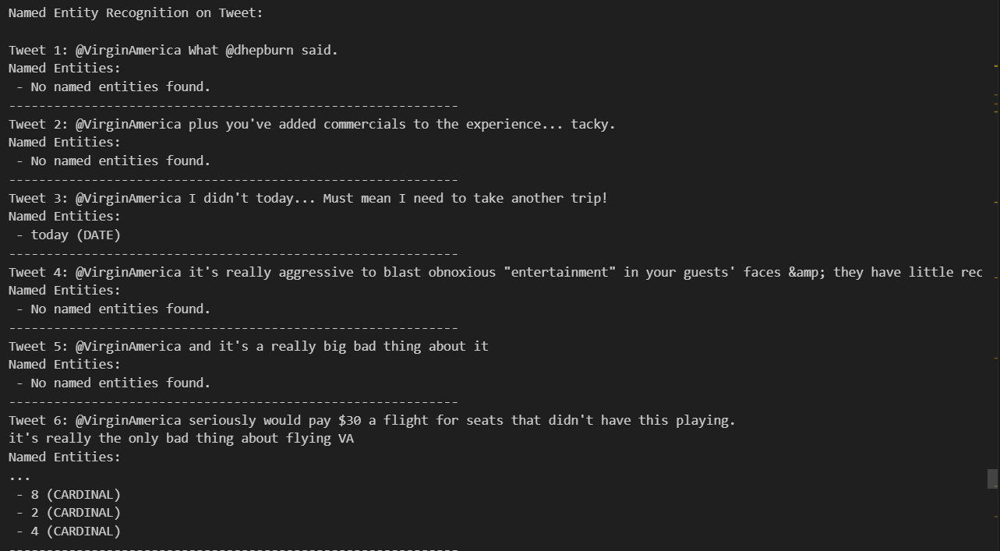

# Sentiment Analysis on Tweets Dataset

A comprehensive Natural Language Processing (NLP) project that performs sentiment analysis on airline tweets using multiple machine learning and deep learning models.

## 🎯 Overview

This project analyzes sentiment in airline-related tweets to classify them as **positive**, **negative**, or **neutral**. It implements and compares five different approaches to sentiment analysis, from rule-based methods to state-of-the-art transformer models.

## ✨ Features

- **Advanced Text Preprocessing**: Comprehensive cleaning including contraction expansion, lemmatization with POS tagging, and stopword removal
- **Multiple Model Comparison**: Five different sentiment analysis approaches
- **Named Entity Recognition (NER)**: Extraction of entities from tweets
- **Rich Visualizations**: Word clouds, sentiment distribution charts, and model comparison plots
- **Word Frequency Analysis**: Top words identification across the dataset

## 📊 Dataset

The project uses the **Tweets.csv** dataset containing airline customer feedback with the following structure:
- **text**: Raw tweet content
- **airline_sentiment**: Sentiment label (positive, negative, neutral)
- Additional metadata about airlines and tweet characteristics

## 🔄 Project Workflow

### 1. **Text Preprocessing**
- Convert text to lowercase
- Remove Twitter handles, hashtags, URLs, and HTML entities
- Handle repeated characters
- Expand contractions (e.g., "don't" → "do not")
- Tokenization
- Lemmatization with Part-of-Speech tagging
- Stop words removal (preserving negations: 'no', 'not', 'nor', 'never')

### 2. **Word Frequency Analysis**
- Individual tweet word frequency counting
- Aggregated word frequency across all tweets
- Top 5 most common words identification

### 3. **Exploratory Data Analysis**
- Sentiment distribution visualization
- Bar plots showing sentiment counts

### 4. **Sentiment Analysis Models**

#### Model 1: TextBlob (Rule-Based)
- Lexicon-based sentiment analysis
- Polarity score calculation
- Simple and fast baseline model

#### Model 2: Naive Bayes with TF-IDF
- Traditional machine learning approach
- TF-IDF vectorization for feature extraction
- Multinomial Naive Bayes classifier

#### Model 3: Random Forest with TF-IDF
- Ensemble learning method
- 200 decision trees
- TF-IDF feature representation

#### Model 4: Pre-trained BERT Pipeline
- Transformer-based model
- Zero-shot sentiment classification
- Hugging Face pipeline implementation

#### Model 5: Fine-tuned DistilBERT
- Custom fine-tuned model on airline tweets
- 3-class classification (positive, negative, neutral)
- Optimized for the specific domain

### Model Evaluation Results

#### TextBlob Analysis

#### Naive Bayes Evaluation

#### Random Forest Evaluation

#### BERT Evaluation

#### Fine-tuned BERT Evaluation

### Models Comparison

### 5. **Named Entity Recognition (NER)**
- Extract entities using SpaCy
- Identify people, organizations, locations, etc.
- Applied to all tweets in the dataset

### 6. **Word Cloud Visualizations**
- Overall word cloud from all processed tweets
- Sentiment-specific word clouds (positive, negative, neutral)
- Visual representation of the most frequent terms

#### Overall Word Cloud

#### Positive Sentiment Word Cloud

#### Negative Sentiment Word Cloud

#### Neutral Sentiment Word Cloud

## 📈 Results

### Model Performance Comparison

| Model | Accuracy | Key Features |
|-------|----------|--------------|
| TextBlob | ~40-50% | Fast, rule-based, no training required |
| Naive Bayes (TF-IDF) | ~75-80% | Traditional ML, interpretable |
| Random Forest (TF-IDF) | ~75-80% | Ensemble method, robust |
| BERT Pipeline | ~50-60% | Pre-trained, general-purpose |
| Fine-tuned DistilBERT | **~85-90%** | Domain-adapted, best performance |

### Key Findings
- Fine-tuned transformer models significantly outperform rule-based approaches
- Traditional ML methods (Naive Bayes, Random Forest) provide a good balance between performance and computational cost
- Domain-specific fine-tuning improves accuracy by 10-15%
- Most common words in negative tweets relate to delays, cancellations, and customer service issues

## 🎨 Visualizations

The project includes multiple visualizations:
1. **Sentiment Distribution Bar Chart** - Shows class imbalance in the dataset
2. **Word Clouds** - Visual representation of term frequency
3. **Model Accuracy Comparison** - Bar chart comparing all models
4. **Confusion Matrices** - Detailed classification performance

## 🛠️ Technologies Used

- **Data Processing**: Pandas, NumPy
- **NLP Libraries**: NLTK, SpaCy, TextBlob
- **Machine Learning**: Scikit-learn
- **Deep Learning**: PyTorch, Transformers (Hugging Face)
- **Visualization**: Matplotlib, Seaborn, WordCloud
- **Text Preprocessing**: Contractions, NLTK Lemmatizer

## 👤 Author

- GitHub: [@mianafzaal297](https://github.com/mianafzaal297)
- LinkedIn: [Muhammad Afzaal](https://www.linkedin.com/in/mianafzaal297)

